# Sky companion

#### Sky Companion is created by students from Dalhousie University as part of the CSCI 5308 - Advanced Topics in Software Development (Fall 2023) course.

### Problem Statement

People often require assistance when traveling. This frequently happens on flights with multiple stopovers. People need to check in, security check, navigate the airport, need in-flight support, change terminals, and even check in their luggage sometimes again on the same route. Through our system, users will be able to find companions who will help them on their journey. The companion will already be traveling on the same route.

### Our Solution

Sky Companion is an affordable way to find companions on the same flight. Free companionship is provided by Volunteers. End to end Availability on a wide range of routes as anyone can be a companion, independent of airlines. It provides an option to Customize the routes. Profile review and rating along with chat feature.


[](https://git.cs.dal.ca/courses/2023-fall/csci-5308/Group05/-/commits/main)


### Test Case Coverage


## Build and Deployment Instructions

## React Project

Move to react project directory `sky-companion-react`

#### Prerequisites

1. **Project Environment Setup:**
   - Download and set up [pnpm](https://pnpm.io/installation).
   - Use pnpm to install dependencies for the checked-out project.

2. **Install Visual Studio Code Extensions:**
   - Upon checking out the project, install the recommended extensions when prompted.
   - If not prompted, open the `extensions.json` file in the `.vscode` folder and install all mentioned extensions.

3. **Set Up Prettier in VS Code:**
   - Install the Prettier and Prettier-eslint extensions.
   - Open VS Code settings/preferences, search for "format on save," and select Prettier as the default formatter.

#### Environment Variables

Create a `.env` file in the React project root with the following environment variable:

```env
VITE_PUBLIC_API_BASE_URL=${api-url} # Backend API URL used by the frontend
```

#### Running the Project

1. Run the following commands from the project directory:
   ```bash
   pnpm install
   pnpm run dev
   ```
2. The project will be available at [http://localhost:3000](http://localhost:3000).


### Build

To build following project run following commands
  ```bash
   pnpm install
   pnpm run build
   ```
This will create a `dist` folder in react project root.

### Serve

[serve](https://www.npmjs.com/package/serve) is a simple, zero-configuration command-line tool to serve your static files:
  ```bash
   serve -s dist -p 3000
   ```

This will serve the static application on machine's ip address if you are running on local access at [http://localhost:3000](http://localhost:3000) else access application on your machine's public ip address with port 3000.

### Pipeline

Our pipeline build and serve react application using above commands.

## Java Project

Move to java project directory `sky-companion-java`

#### Prerequisites

1. Install [IntelliJ IDEA](https://www.jetbrains.com/idea/) or similar IDE for development
2. Install [Java](https://openjdk.org/projects/jdk8/)
3. Install [Maven](https://maven.apache.org/download.cgi) 

#### IntelliJ IDEA Setup

1. In settings, find "Actions on Save" and enable all options except "Build code."
2. Install the SonarLint plugin for code quality:
   - [SonarLint Plugin](https://plugins.jetbrains.com/plugin/7973-sonarlint)

#### Running the Project

1. Locate the `SkyCompanionApplication` class and run it as a Java application.
2. Visit [http://localhost:8080](http://localhost:8080) and check the logs for successful execution.

#### Running Test Cases

1. Run the following command to execute test cases:
   ```bash
   mvn test
   ```
2. View the test results in the terminal.

#### Build

1. Run the following command to build and package:
  ```bash
   mvn compile
   mvn clean package
   ```
2. This will create a `sky-companion.jar` in `target` directory.


#### Serve

Locate `sky-companion.jar` in `target` directory and run following command:
  ```bash
   java -jar sky-companion.jar
   ```
This will serve the java application on machine's ip address if you are running on local access at [http://localhost:8080](http://localhost:8080) else access application on your machine's public ip address with port 8080. 

### Pipeline

Our pipeline build and serve java application using above commands.


## Deployed Application

The deployed project can be accessed at http://csci5308vm5.research.cs.dal.ca:3000

Requires Dal VPN (setup: https://dalu.sharepoint.com/sites/its/SitePages/vpn.aspx)


## Test Driven Development 
### Save Search Alert functionality
- Test case commit functionality : https://git.cs.dal.ca/courses/2023-fall/csci-5308/Group05/-/commit/c315d27e742fe4794f7d813a29b887209ea7af94
- Functionality code commit : https://git.cs.dal.ca/courses/2023-fall/csci-5308/Group05/-/commit/0e88c7c81836e94bcbce4e39c3082abc4a42664e

### Get Trip functionality
- Test case commit functionality : https://git.cs.dal.ca/courses/2023-fall/csci-5308/Group05/-/commit/25f734b35c06be71a3693779498a287d34280b8d
- Functionality code commit : https://git.cs.dal.ca/courses/2023-fall/csci-5308/Group05/-/commit/a4cb7a6d14556b78f14c2e1af8c0862e12a7406e

### Delete Trip functionality
- Test case commit : https://git.cs.dal.ca/courses/2023-fall/csci-5308/Group05/-/commit/fb0920db02a35c578f7b19132debdfe209c77a85
- Functionality code commit : https://git.cs.dal.ca/courses/2023-fall/csci-5308/Group05/-/commit/a0721feeb512695220d187113227b502f2d7907a

### Get Reviews and rating functionality
- Test case commit : https://git.cs.dal.ca/courses/2023-fall/csci-5308/Group05/-/commit/d88b74f2fb21f6d2359c05dd45a002e258a90216
- Functionality code commit : https://git.cs.dal.ca/courses/2023-fall/csci-5308/Group05/-/commit/3a5cac40579511264c49c8e8462a75621cb0cab7

### Save Reviews and rating functionality
- Test case commit : https://git.cs.dal.ca/courses/2023-fall/csci-5308/Group05/-/commit/203cf47718ba1640c4d5fe3c13c65b946435e6d4
- Functionality code commit : https://git.cs.dal.ca/courses/2023-fall/csci-5308/Group05/-/commit/e637d16dd46c6f5105a5374449869b968475b59f

## Dependencies

### Frameworks and Tools used

| Dependency Name | Version | Description |
| --- | --- | --- |
| [VS Code](https://code.visualstudio.com/) | 1.84 | A code editing platform that offers a wide range of features for software development, including code completion, debugging, and version control. |
| [Intellij idea](https://www.jetbrains.com/idea/) | 2023.1 | A powerful integrated development environment (IDE) for Java, Kotlin, and other languages, offering a wide range of features for software development, including code completion, debugging, and version control. |
| [MySQL](https://www.mysql.com/products/workbench/) | 8.0 | A popular open-source relational database management system (RDBMS) used for storing, manipulating, and retrieving data in various formats. |
| [Postman](https://www.postman.com/downloads/) | 8.13.0 | A tool for testing, building, and troubleshooting APIs, offering a wide range of features such as API request builders, response analyzers, and collaboration tools. |
| [Maven](https://maven.apache.org/download.cgi) | 3.8.1 | An open-source build automation tool used for managing and building software projects, offering a wide range of features such as dependency management, project management, and build automation. |
| [Java 8](https://openjdk.org/projects/jdk8/) | 8.0 | A version of the Java programming language and runtime environment, offering a wide range of features such as improved performance, security, and compatibility. |
| [Node JS](https://nodejs.org/en) | 14.17.0 | A JavaScript runtime built on Chrome's V8 JavaScript engine, used for developing scalable, high-performance applications, offering a wide range of features such as event-driven programming, non-blocking I/O, and a vast ecosystem of packages. |

### React Runtime Dependencies

The following is a list of necessary dependencies for building this React application using TypeScript and Vite.

| Name | Version | Description |
| --- | --- | --- |
| @tanstack/react-query | ^4.35.3 | A library for handling data fetching and caching in React applications. |
| @types/react-star-ratings | ^2.3.3 | Type definitions for the React Star Ratings component. |
| axios | ^1.5.0 | A promise-based HTTP client for JavaScript. |
| dayjs | ^1.11.10 | A lightweight JavaScript date library for parsing, validating, manipulating, and formatting dates. |
| react | ^18.2.0 | A JavaScript library for building user interfaces. |
| react-dom | ^18.2.0 | A library for rendering React components to the DOM. |
| react-router-dom | ^6.16.0 | A library for handling client-side routing in React applications. |
| react-star-ratings | ^2.3.0 | A React component for displaying star ratings. |
| react-toastify | ^9.1.3 | A library for displaying toast notifications in React applications. |
| react-typed | ^1.2.0 | A library for adding type definitions to React components. |
| zustand | ^4.4.1 | A library for managing state in React applications. |

### React Development Dependencies

| Name | Version | Description |
| --- | --- | --- |
| @types/node | ^20.6.2 | Type definitions for Node.js. |
| @types/react | ^18.2.15 | Type definitions for React. |
| @types/react-dom | ^18.2.7 | Type definitions for ReactDOM. |
| @typescript-eslint/eslint-plugin | ^6.0.0 | An ESLint plugin for TypeScript. |
| @typescript-eslint/parser | ^6.0.0 | An ESLint parser for TypeScript. |
| @vitejs/plugin-react | ^4.0.3 | A Vite plugin for React. |
| autoprefixer | ^10.4.15 | A PostCSS plugin for adding vendor prefixes to CSS rules. |
| eslint | ^8.45.0 | A tool for identifying and reporting patterns found in ECMAScript/JavaScript code. |
| eslint-config-prettier | ^9.0.0 | An ESLint configuration for Prettier. |
| eslint-formatter-gitlab | ^5.1.0 | An ESLint formatted for GitLab. |
| eslint-plugin-react | ^7.33.2 | An ESLint plugin for React. |
| eslint-plugin-react-hooks | ^4.6.0 | An ESLint plugin for React hooks. |
| eslint-plugin-react-refresh | ^0.4.3 | An ESLint plugin for React refresh. |
| postcss | ^8.4.30 | A tool for transforming styles with JS plugins. |
| prettier-plugin-organize-imports | ^3.2.3 | A Prettier plugin for organizing imports. |
| tailwindcss | ^3.3.3 | A utility-first CSS framework for rapidly building custom designs. |
| typescript | ^5.0.2 | A superset of JavaScript that adds optional static typing and other features. |
| vite | ^4.4.5 | A fast and efficient frontend build tool. |

These dependencies are required for building and running the application. The development dependencies are used during development and testing.


### Spring Boot Dependencies

| Dependency Name | Version | Short Description |
| --- | --- | --- |
| spring-boot-starter-data-jpa | 2.7.16 | Spring Boot starter for JsPA |
| spring-boot-starter-security | 2.7.16 | Spring Boot starter for security |
| spring-boot-starter-validation | 2.7.16 | Spring Boot starter for validation |
| spring-boot-starter-web | 2.7.16 | Spring Boot starter for web |
| spring-boot-devtools | 2.7.16 | Spring Boot devtools for debugging |
| mysql-connector-j | 8.0.28 | MySQL connector for Java |
| spring-boot-starter-test | 2.7.16 | Spring Boot starter for testing |
| spring-security-test | 5.7.1 | Spring Security test |

### Mockito Dependencies

| Dependency Name | Version | Short Description |
| --- | --- | --- |
| mockito-core | 3.12.4 | Mockito core for testing |
| mockito-inline | 3.12.4 | Mockito inline for testing |
| mockito-junit-jupiter | 3.12.4 | Mockito JUnit Jupiter for testing |

### JSON Web Token (JWT) Dependencies

| Dependency Name | Version | Short Description |
| --- | --- | --- |
| jjwt-api | 0.11.1 | JSON Web Token API |
| jjwt-impl | 0.11.1 | JSON Web Token implementation |
| jjwt-jackson | 0.11.1 | JSON Web Token Jackson implementation |

### Build Tools

| Dependency | Version | Description |
| --- | --- | --- |
| spring-boot-maven-plugin | 2.3.0 | A convenient way to package and run Spring Boot applications. |

## Usage Scenarios for Sky Companion

### Introduction

Sky Companion is a platform designed to connect individuals looking for travel companions. This outlines the user interaction flow, from website entry to the start of a travel journey, including steps for account creation, login, and password recovery.

The following User Flow Diagram explains how different scenarios interact with different features of the application

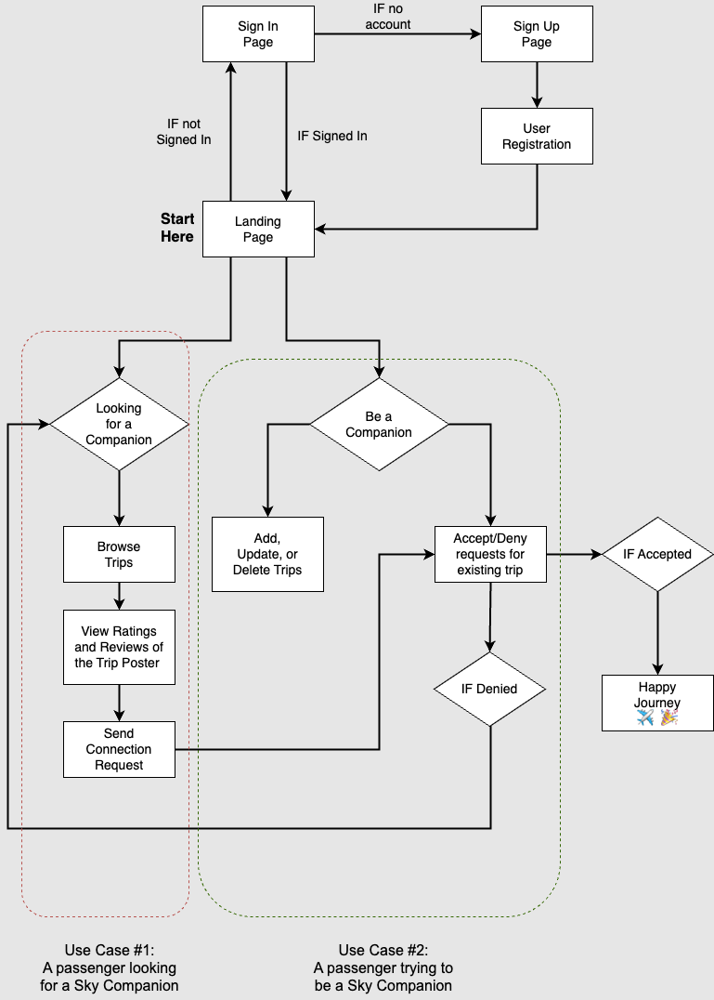


### Screens common for all users
#### Landing Page

- **URL**: `http://csci5308vm5.research.cs.dal.ca:3000/home`
- Upon visiting Sky Companion, users are presented with options to `Log In` or `Sign Up`.

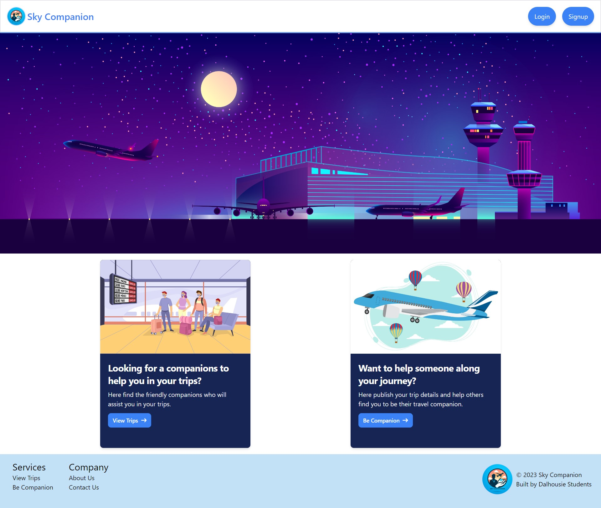

#### Authentication

##### Log In

- Existing users enter their credentials to access their accounts.

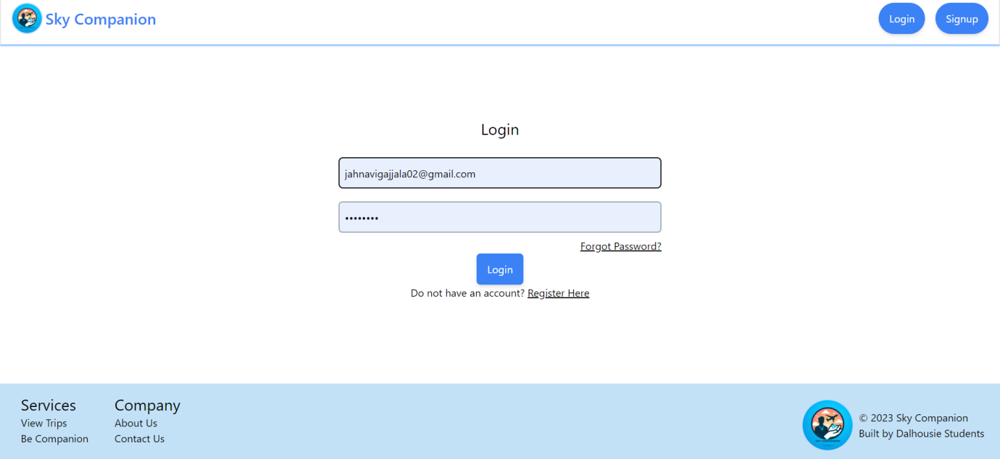

##### Sign Up

- New users navigate to the `Sign Up Page` and complete `User Registration` to create an account.


- Users must verify their email address to activate their account.

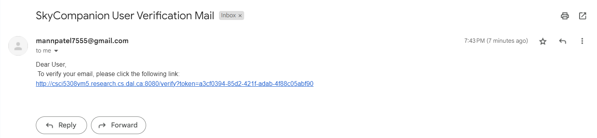

- Once the user clicks on the verification link, they are redirected to this page. Now, the user can log in.

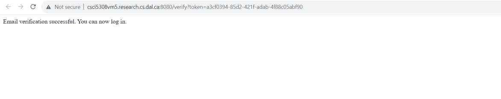

##### Forgot Password
- Users who have forgotten their password can use the 'Forgot Password' link to reset it via their registered email.

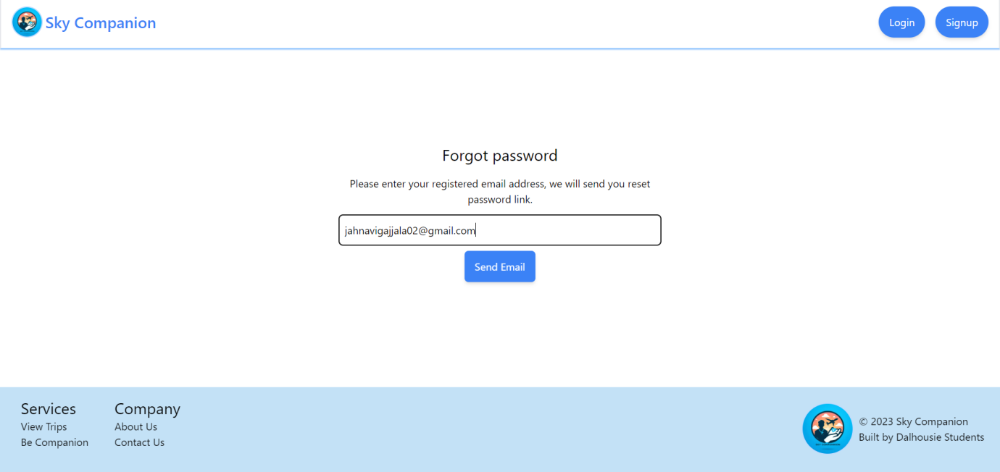

#### User Dashboard

- Once authenticated, the user is directed to the landing page. The dashboard offers two main pathways: 'Looking for a Companion' and 'Be a Companion.'

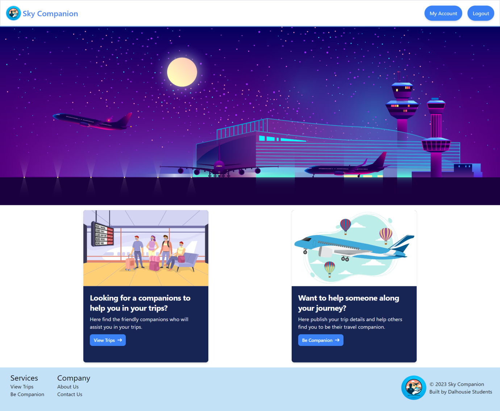

#### Modify Profile

- Users can update their personal details such as name, email, and phone number.
- Location details can be updated to enhance the search for companions based on similar locations.
- Language preferences can be set to match with users who speak the same languages.

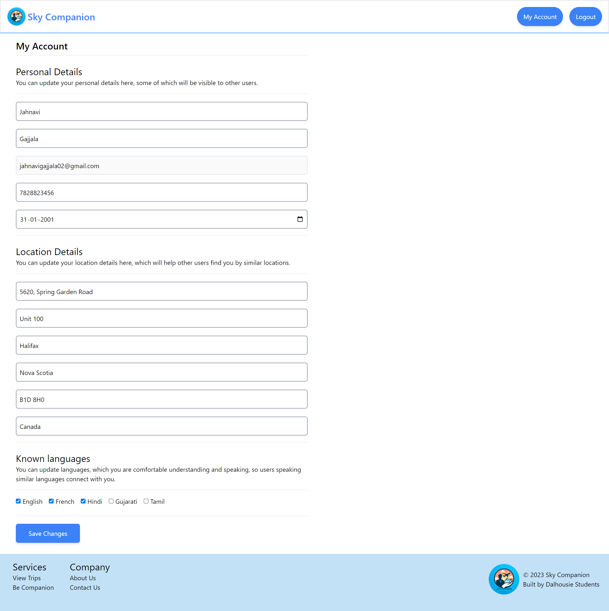

### Screens for users looking for a Companion

- Users select `View Trips` to browse available trips.

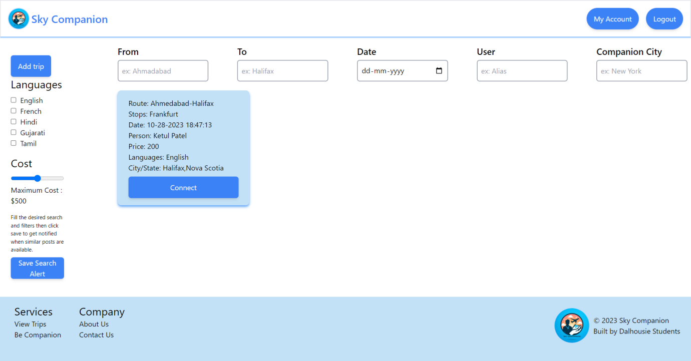

- Users can connect with trip posters by clicking on `Connect` and can view the person's ratings and reviews.

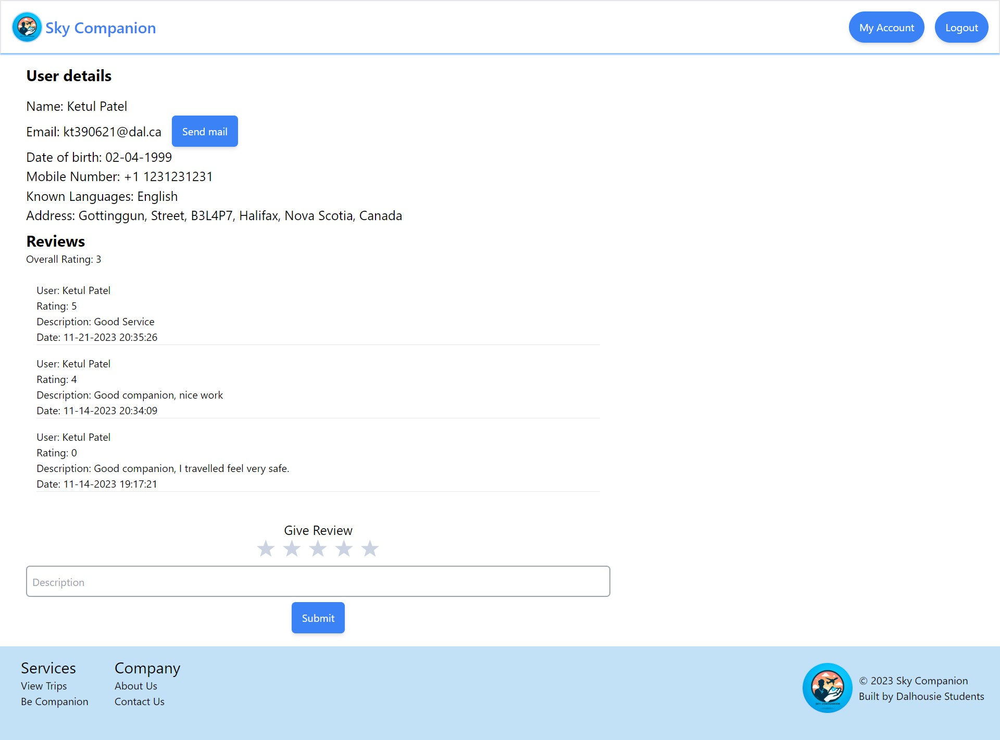

- To send a companionship request to the companion, click on “Send Email” button.

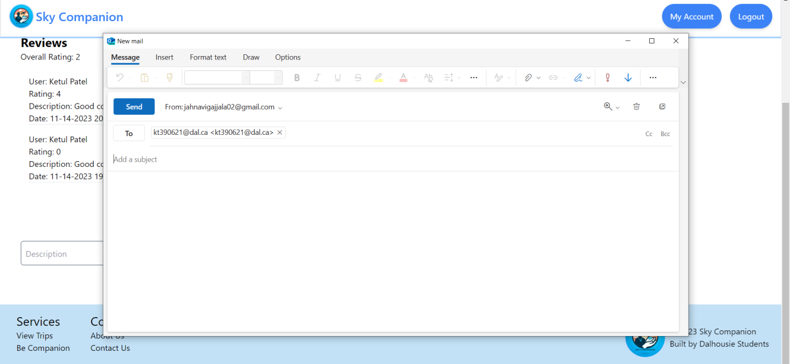

### Save Search Alert

- Users can set filters and preferences for their trip search.
- By clicking `Save Search Alert`, users can receive notifications when trips matching their criteria are posted.

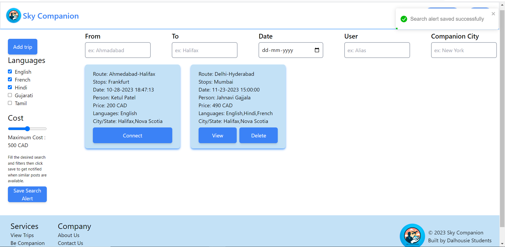

### Screens for users looking to be a Companion

- Users wishing to offer companionship can `Add`, `Update`, or `Delete` trips in their profile.


- To add a trip, users click on `Be Companion`.
- When a trip is added, other users can send requests to join.
- Users can accept or deny join requests for their trips.

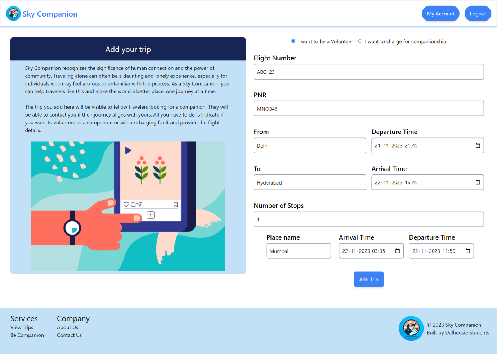

- The trip is added and can be viewed in “View trips”.

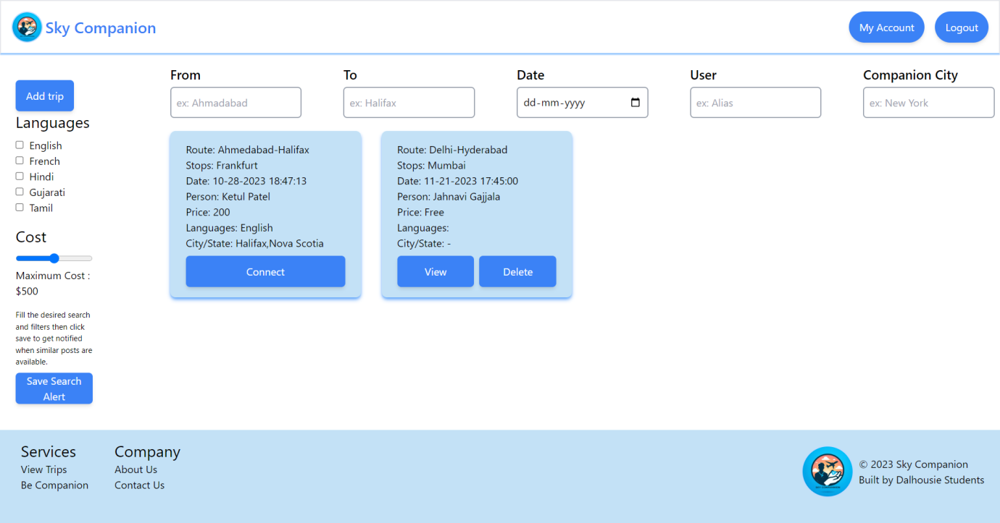

- To delete the trip, click on “Delete” button of the post. Only the person who added the trip can delete it.


- To edit the trip, click on “View” button of the post. Only the person who added the trip can edit it. The change can be made in the paid or volunteer service option.

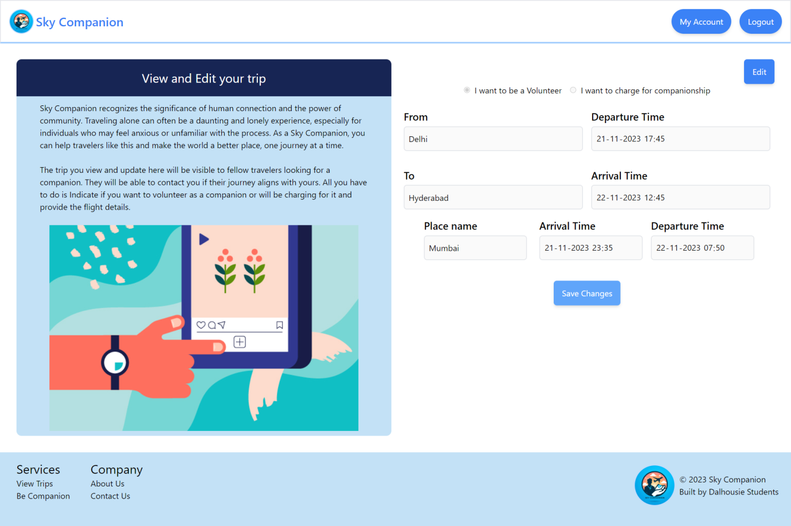

- If they want to change to paid service, select "I want to charge for companionship" and enter the price.

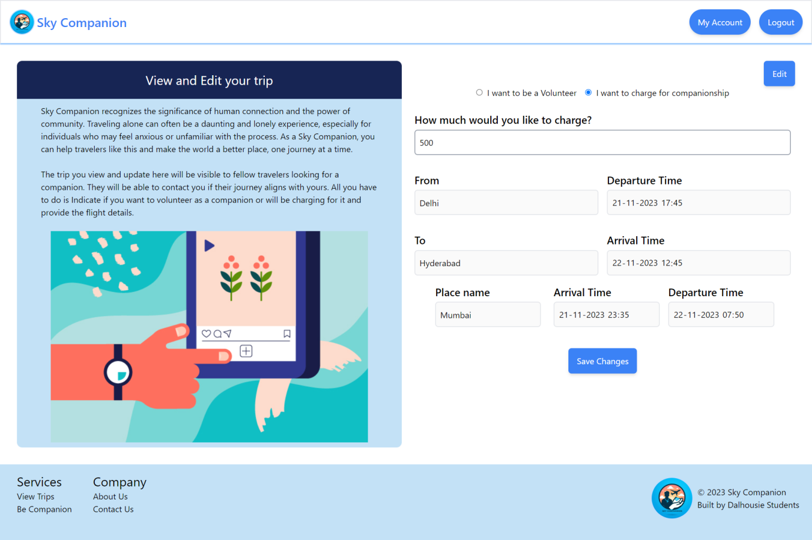

- Click on "Save Changes" to save.

### Matching Process

- When a join request is received, the user reviews the requester's profile.
- If the user accepts the request, both parties are notified.
- If denied, the requester is notified and can continue to search.

### Post-Journey

- Users are encouraged to rate and review their travel companions post-journey.

## Conclusion

This provides the steps a user will follow on the Sky Companion service, ensuring a clear path from sign-up to journey engagement.

## Credits

### Development team:

1. Divyank Mayankkumar Shah
2. Jahnavi Gajjala
3. Jahnavi Prasad Srirampurapu
4. Ketul Patel
5. Mann Patel

### Client team:

1. Aditya Maheshbhai Purohit
2. Dharmil Nareshkumar Shah
3. Princess Ashwinbhai Kachhadiya
4. Roshni Vikrambhai Joshi
5. Ubaidullah Muhammad Naeem

Course Instructor: [Dr. Tushar Sharma](https://tusharma.in)